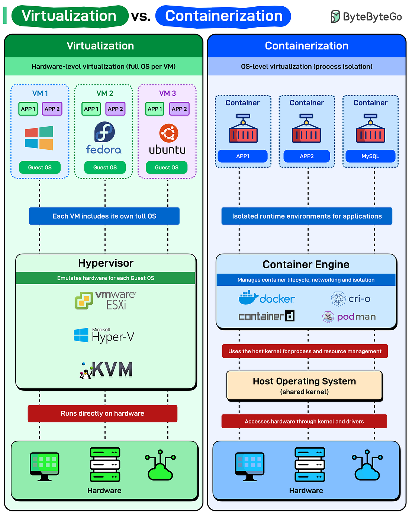
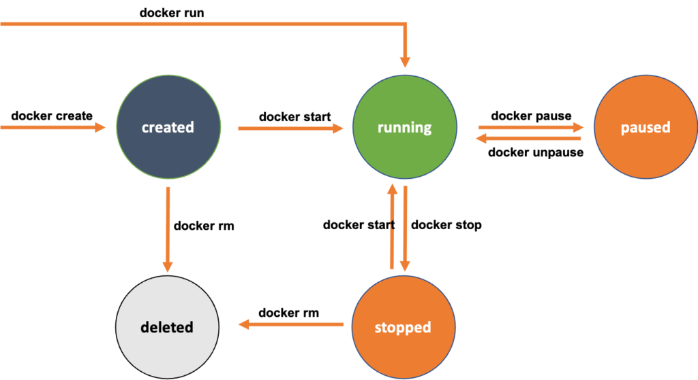
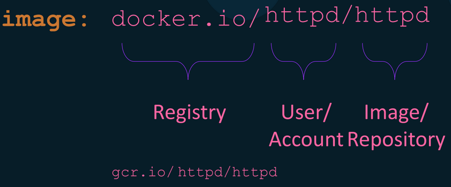

<h2> Docker Comprehensive Cheat Sheet & Reference Guide 🐳 </h2>

- [Containerization vs Virtualization](#containerization-vs-virtualization)
- [Let’s try some basic command](#lets-try-some-basic-command)
- [Managing Docker Services and Sockets with Systemd](#managing-docker-services-and-sockets-with-systemd)
- [The lifecycle of a Docker container](#the-lifecycle-of-a-docker-container)
- [Why a Docker container exits!!!](#why-a-docker-container-exits)
  - [Container Management](#container-management)
  - [Build Docker Images](#build-docker-images)
- [Authenticating to Registries](#authenticating-to-registries)
- [Docker Image Management](#docker-image-management)
- [Docker Image Layer](#docker-image-layer)
- [Difference between CMD vs ENTRYPOINT Docker!](#difference-between-cmd-vs-entrypoint-docker)
- [Don,t Ignore .dockerignore](#dont-ignore-dockerignore)
- [Docker Args \& Environment Variables](#docker-args--environment-variables)
- [Docker volume:](#docker-volume)
  - [Summary Table](#summary-table)
- [Docker Namespace](#docker-namespace)
  - [PID (Process ID) Namespace](#pid-process-id-namespace)
  - [Network Namespace](#network-namespace)
  - [Mount Namespace](#mount-namespace)
  - [UTS Namespace](#uts-namespace)
  - [IPC Namespace](#ipc-namespace)
  - [User Namespace](#user-namespace)
  - [Summary](#summary)
- [Docker Cgroups (Control Groups)](#docker-cgroups-control-groups)
  - [CPU Controller](#cpu-controller)
  - [Memory Controller](#memory-controller)
  - [Block I/O (blkio) Controller](#block-io-blkio-controller)
  - [PIDs Controller](#pids-controller)
  - [Summary of Cgroup Controllers in Docker](#summary-of-cgroup-controllers-in-docker)
- [Docker Networking](#docker-networking)
  - [Bridge Network Driver](#bridge-network-driver)
  - [Host Network Driver](#host-network-driver)
  - [IPvlan Network Driver](#ipvlan-network-driver)
  - [Macvlan Network Driver](#macvlan-network-driver)
  - [Null (none) Network Driver](#null-none-network-driver)
  - [Overlay Network Driver](#overlay-network-driver)
- [Building Multi Container Application with Docker, Dockercompose](#building-multi-container-application-with-docker-dockercompose)
- [Docker Security \& Hardening](#docker-security--hardening)
  - [Docker Security Threat Model](#docker-security-threat-model)
    - [Container escape](#container-escape)
    - [Secure Dockerfile (Non‑Root User)](#secure-dockerfile-nonroot-user)
    - [🚫 Don’t Pull Untrusted Container Images](#-dont-pull-untrusted-container-images)
    - [🔐 Data Exfiltration Risk in Containers](#-data-exfiltration-risk-in-containers)
  - [Image Cleanup](#image-cleanup)
  - [Volume Cleanup](#volume-cleanup)
  - [Network Cleanup](#network-cleanup)
  - [System-Wide Cleanup](#system-wide-cleanup)
  - [Selective Cleanup](#selective-cleanup)
  - [By Age/Date](#by-agedate)
  - [Exit Code Based Cleanup](#exit-code-based-cleanup)

# Containerization vs Virtualization

**Virtualization:** Each VM runs a full OS with its own kernel and drivers via a hypervisor (VMware, Hyper-V, KVM). Heavy but fully isolated; VMs take minutes to start.

**Containerization:** Containers share the host OS kernel, running isolated processes with their own filesystem. Lightweight and fast, starting in milliseconds. All containers must match the host kernel (e.g., Linux containers on Linux).


<!-- Centered image with width and height -->

<p align="center">
  
</p>

<!-- Optional caption -->

<p align="center"><em>Figure 1: Virtualization vs. Containerization</em></p>


| Feature            | Virtualization (VMs)                                                            | Containerization (Docker, Podman)                                                                 |
| ------------------ | ------------------------------------------------------------------------------- | ------------------------------------------------------------------------------------------------- |
| **Definition**     | Running multiple virtual machines on a single physical host using a hypervisor. | Running multiple containers sharing the same OS kernel on a single host using a container engine. |
| **Isolation**      | Full isolation with separate OS for each VM.                                    | Process-level isolation using namespaces and cgroups, sharing the host OS kernel.                 |
| **Resource Usage** | Heavy, because each VM includes a full OS.                                      | Lightweight, containers only include the application and dependencies.                            |
| **Startup Time**   | Slow, minutes to boot an OS.                                                    | Fast, seconds to start a container.                                                               |
| **Portability**    | VMs are less portable, depend on hypervisor compatibility.                      | Containers are highly portable: “Build once, run anywhere”.                                       |
| **Performance**    | Slightly lower, due to full OS overhead.                                        | Near-native performance, minimal overhead.                                                        |
| **Size**           | Large (GBs per VM)                                                              | Small (MBs per container)                                                                         |
| **Use Case**       | Running multiple OS types, legacy applications, full OS isolation.              | Microservices, CI/CD pipelines, cloud-native applications.                                        |
| **Management**     | Requires hypervisor management, OS updates, and patching per VM.                | Easier to manage, simpler to deploy and scale applications.                                       |


# Let’s try some basic command 

🔹 Basic Commands
```bash
docker version
docker info
docker ps
docker ps -a
docker images
docker pull nginx
docker system df
```

🔹 Run Containers
```bash
docker run nginx
docker run -d nginx
docker run -d --name web -p 8080:80 nginx
docker run -it ubuntu bash
```

🔹 Start / Stop / Restart
```bash
docker stop <id>
docker start <id>
docker restart <id>
docker kill <id>
```
🔹 Remove Containers / Images
```bash
docker rm <id>
docker rm -f <id>
docker rmi <image>
docker system prune
docker image prune -a
docker container prune
```

🔹 Logs / Exec / Inspect
```bash
docker logs <id>
docker exec -it <id> bash
docker inspect <id>
docker stats
docker top <id>
```
🔹 Copy Files
```bash
docker cp <id>:/path ./localpath
docker cp ./localpath <id>:/path
```

# Managing Docker Services and Sockets with Systemd

Docker service can still be activated through the Docker socket (`docker.socket`) even if you stop the Docker service (`docker.service`). The Docker socket allows communication with the Docker daemon and is used for Docker API access.

```bash
sudo systemctl status docker
sudo systemctl stop docker
sudo systemctl status docker
sudo systemctl stop docker.socket
```

---

# The lifecycle of a Docker container
The lifecycle of a Docker container involves creation, running, stopping, and removal. Containers are created from Docker images, run as isolated instances, can be stopped or paused, and can be removed when no longer needed.


<!-- Centered image with width and height -->

<p align="center">
  
</p>

<!-- Optional caption -->

<p align="center"><em>Figure 1: Lifecycle of Docker Container</em></p>


**Example**

1. docker create:
Purpose: Creates a new container but does not start it.
Example: Creates a new container named "my-container" using the Nginx image but does not start it.
```
docker create --name my-container nginx
```

2. docker start:
Purpose: Starts one or more stopped containers.
Example: Starts the container named "my-container" that was previously created but stopped.
```
docker start my-container
```

3. docker run:
Purpose: Creates and starts a new container in a single command.
Example: This command combines the process of creating and starting a container named "my-container" using the Nginx image in a single step.
```
docker run --name my-container nginx
```

4. docker pause:
Purpose: Temporarily pause the processes in the running container. Example:
```bash
docker pause my-container
docker ps --filter "name=my-container"
docker unpause my-container
docker ps --filter "name=my-container"
```
5. docker stop:
Purpose: The docker stop command is used to stop a running container.Example: This command stop a container named "my-container".
```
docker stop my-container
```

6. docker rm:
Purpose: The docker rm command is used to remove a container.Example: Want to remove container named "my-container".
```
docker rm my-container
```

---

# Why a Docker container exits!!!
Docker containers are designed to run a specific command or process and exit when that command or process completes. The default behavior is to start the specified command or process inside the container and stop when that command or process finishes execution.
Docker containers run as long as the process inside the container is active.
Example: Default Shell Behavior (Container Stops Immediately).
Run a Command to Keep Container Running (e.g., Sleep). In the third example, the sleep 3600 command will keep the container running for 3600 seconds (1 hour), and then it will exit.
```
docker run busybox
docker run -it busybox
docker run busybox sleep 3600
```

---
## Container Management

Run a container from an image.
```
docker ps
docker ps -a
docker exec my-nginx ls /usr/share/nginx/html
docker inspect my-nginx
docker stop my-nginx
docker container stop $(docker container ps -q)
docker start 24952546f818
docker restart 24952546f818
docker restart -t 30 6d144a1d546b
docker inspect --format='{{.Id}}' nginx
```

## Build Docker Images

**What is a Docker Image?**
A Docker image is a read-only template that contains a set of instructions for creating a container that can run on the Docker platform.

**What is docker base image?**
A Docker base image is the initial image used as the foundation for building a Docker container.
It serves as the starting point from which your application and its dependencies are added to create a runnable environment.
Base images are typically pre-configured operating system images with certain tools, libraries, and settings already installed.

**Here's a basic Dockerfile for a Python "Hello, World!" application.**

```
vim app.py
```

```bash
from flask import Flask, Response
import requests
import datetime
import random

app = Flask(__name__)

@app.route('/<user>')
def hello_world(user):
    # Current server time
    current_time = datetime.datetime.now().strftime("%Y-%m-%d %H:%M:%S")
    
    # Call external API (GitHub)
    try:
        response = requests.get("https://api.github.com")
        api_status = response.status_code
    except:
        api_status = "Failed to reach API"
    
    # Funny messages
    funny_messages = [
        "Did you bring snacks? Because coding is hungry work! 🍕",
        "I tried to be normal once. Worst two minutes ever. 😎",
        "Keep calm and Docker on! 🐳",
        "Why do programmers prefer dark mode? Because light attracts bugs! 🐛"
    ]
    
    random_funny = random.choice(funny_messages)
    
    # HTML content with improved styling
    html_content = f"""
    <html>
        <head>
            <title>Docker + Flask Fun</title>
            <style>
                body {{
                    font-family: Arial, sans-serif;
                    text-align: center;
                    background-color: #f0f8ff;
                    padding-top: 50px;
                }}
                h1 {{
                    font-size: 60px;
                    font-weight: bold;
                    color: #333;
                }}
                p.funny {{
                    font-size: 28px;
                    font-weight: bold;
                    color: #0077cc;
                    margin-top: 20px;
                }}
                p.info {{
                    font-size: 22px;
                    color: #555;
                    margin-top: 15px;
                }}
            </style>
        </head>
        <body>
            <h1>Hello, {user}! 😁</h1>
            <p class="funny">{random_funny}</p>
            <p class="info">
                Server time: {current_time} <br>
                GitHub API status: {api_status}
            </p>
        </body>
    </html>
    """
    
    return Response(html_content, mimetype='text/html')

@app.route('/')
def default_user():
    return hello_world("Guest")

if __name__ == '__main__':
    app.run(host='0.0.0.0', port=8000)
```
```
vim requirements.txt
```

```bash
flask
requests
#pandas
#beautifulsoup4
```

```bash
vim Dockerfile
```

```bash
# Use an official Python runtime as a parent image
FROM python:3.8-slim

# Set environment variables
ENV PYTHONUNBUFFERED=1

# Set the working directory in the container
WORKDIR /app

# Copy the requirements file first
COPY requirements.txt /app/

# Install Python dependencies
RUN pip install --no-cache-dir -r requirements.txt

# Copy the application code into the container
COPY . /app

# Expose the application port
EXPOSE 8000

# Run the application
CMD ["python", "app.py"]
```

🔹 ## Build & Tag Images



```bash
docker build -t myimage:1.0 .
docker tag myimage:1.0 repo/myimage:1.0
docker tag old-image:old-tag new-image:new-tag
```

# Authenticating to Registries
Docker and containerization, a registry is a service that stores and distributes Docker images. Docker images can be stored in public or private registries.
Here's an overview of public and private registries:

**Public Registry**
- Definition: Public storage service for Docker images, accessible to anyone.
- Example: Docker Hub (hub.docker.com).
- Use Cases: Sharing open-source or community-based images.
  
**Private Registry**
- Definition: Secure storage service for Docker images, requires authentication.
- Example: Self-hosted or third-party private registries.
- Use Cases: Storing proprietary or sensitive images, access control.

Log in to Docker Hub.
```
docker login
```

Check local Docker images list.
```
docker image list
```

Push Docker Image to Dockerhub Private Repo.
```
docker push nasirnjs:hello-python:001
```

Log in to a Private Registry.
```
docker login registry.example.com
```

Docker CLI configuration settings, including authentication credentials for Docker registries.
```
cat ~/.docker/config.json 
```

 Display information about disk usage related to Docker.
 ```
 docker system df
 ```
# Docker Image Management
```bash
# Cleanup commands
docker image prune -a
docker system df
docker system prune -a

# Image tagging best practices
docker tag myimage:latest myregistry.com/myimage:v1.0
docker push/pull

# Save/load images
docker save -o myimage.tar myimage:tag
docker load -i myimage.tar
```

# Docker Image Layer
In Docker, images are composed of multiple layers. A docker container image is created using a dockerfile. Every line in a dockerfile will create a layer.
If you make changes to your Dockerfile and rebuild the image, Docker can reuse cached layers to speed up the process, only rebuilding the layers affected by the changes.  Caching plays a significant role in optimizing the build process.
Let's explore both concepts with examples:

```
### Docker Image Layers Explanation

1. **Base Image Layer**:
   - This layer is created when you specify `FROM python:3.8-slim`.
   - It pulls the official Python 3.8 slim image as the base for your image.

2. **Environment Variables Layer**:
   - This layer is created by `ENV PYTHONUNBUFFERED=1`.
   - It sets the `PYTHONUNBUFFERED` environment variable to `1`, ensuring that Python output is unbuffered and immediately printed to stdout.

3. **Working Directory Layer**:
   - This layer is created by `WORKDIR /app`.
   - It sets the working directory inside the container to `/app`.

4. **Copy Requirements Layer**:
   - This layer is created by `COPY requirements.txt /app/`.
   - It copies the `requirements.txt` file from your host machine into the `/app` directory within the container.

5. **Install Dependencies Layer**:
   - This layer is created by `RUN pip install --no-cache-dir -r requirements.txt`.
   - It installs the Python dependencies listed in `requirements.txt` using pip.
   - If the contents of `requirements.txt` haven't changed since the last build, Docker will reuse the cached layer for this step, improving build performance.

6. **Copy Application Code Layer**:
   - This layer is created by `COPY . /app`.
   - It copies the entire contents of your current directory (containing your application code) into the `/app` directory within the container.
   - If your application code hasn't changed since the last build, Docker will reuse the cached layer for this step, improving build performance.

7. **Expose Port Layer**:
   - This layer is created by `EXPOSE 8000`.
   - It exposes port 8000 on the container, allowing external access to the application running inside the container.

8. **Run Application Layer**:
   - This layer is created by `CMD ["python", "app.py"]`.
   - It specifies the default command to run when the container starts, which is to execute the `app.py` Python script using the Python interpreter.
   - This layer defines the entry point for your containerized application.

```

Build Docker Image form [Here](https://github.com/nasirnjs/docker-static-site)

list of `nginx` image layer.
```
docker image inspect nginx -f '{{.RootFS.Layers}}' | awk -F' ' '{for (i=1; i<=NF; i++) print $i}'
```

**Install Dive**
The dive is a command line tool for analyzing a Docker image. This tool shows image contents broken down by layer. It can used to explore image structure in order to minimize size of Docker image. [Reference](https://github.com/wagoodman/dive)

Install dive on Ubuntu
```
sudo snap install dive
```

Uninstall dive
```
sudo apt purge --autoremove -y dive
```


# Difference between CMD vs ENTRYPOINT Docker!

In Docker, both `CMD` and `ENTRYPOINT` are instructions used to specify what command should be run when a container is started.
Y

**Docker CMD**
- Whenever we want to override executable while running the container, use `CMD`.
- We can override the value with a command-line argument.
- We can multiple CMD in a single docker file but only one will be executable while the container start.

**Docker ENTRYPOINT**
- ENTRYPOINT defines the fixed command the container will always run.
- ENTRYPOINT makes the container behave like an executable binary.
- If you pass arguments when running the container, they are appended to ENTRYPOINT unless you use the --entrypoint flag.

```bash
vim app.py
```
```bash
from flask import Flask
import sys

app = Flask(__name__)

@app.route('/')
def hello():
    return "<h1>Hello World from Flask!</h1>"

if __name__ == '__main__':
    # Default port
    port = 5000

    # Look for --port argument
    if '--port' in sys.argv:
        try:
            i = sys.argv.index('--port')
            port = int(sys.argv[i + 1])
        except (IndexError, ValueError):
            print("Warning: Invalid or missing port, using 5000")
            port = 5000

    print(f"Starting Flask on http://0.0.0.0:{port}")
    app.run(host='0.0.0.0', port=port)
```

```
vim requirements.txt
```

```bash
Flask==2.3.3
```

```bash
Dockerfile
```
```bash
# Official slim Python image
FROM python:3.9-slim

# Set working directory
WORKDIR /app

# Install dependencies
COPY requirements.txt .
RUN pip install --no-cache-dir -r requirements.txt

# Copy app code
COPY app.py .

# Expose port (optional, just for documentation)
EXPOSE 5000

# This will ALWAYS run "python app.py"
ENTRYPOINT ["python", "app.py"]

# These are the DEFAULT arguments → can be overridden
CMD ["--port", "5000"]
```


Build Application
```bash
docker build -t myflask .
```
Runs on Default port 5000.
```bash
docker run -p 5000:5000 myflask
```
Override port to 8080
```bash
docker run -p 8080:8080 myflask --port 8080
```
```bash
docker run -p 3000:3000 myflask --port 3000
```

**Conclusion**
- Whenever there is a chance of overriding executable while running the container using CMD otherwise uses ENTRYPOINT.
- Sometimes we don’t have to override the executable all we want to run the container, in that case, ENTRYPOINT is the best use case.
- If ENTRYPOINT is used for the executable, we can use CMD to pass default parameters. In that case, we use both together.


# Don,t Ignore .dockerignore
The `.dockerignore` file is used by Docker to specify files and directories that should be excluded (ignored) when building a Docker image. It works similarly to the more widely known `.gitignore` file used by Git to specify files and directories that should be ignored when tracking changes.

Here's how it works:

- Default Behavior: By default, Docker includes all files and directories in the build context when building an image.
- Use of .dockerignore: If a file named .dockerignore is present in the build context, Docker reads it to determine which files and directories should be excluded from the build context.
- Exclusion Rules: The .dockerignore file follows the same rules as .gitignore. You can use wildcards and patterns to specify files and directories to be excluded.

For example, a .dockerignore file might look like this:
```
# .dockerignore
# Exclude the Dockerfile
Dockerfile
# Exclude the README.md file
README.md
# Exclude the .env file
.env
# Exclude the .git file
.git
```
Complete Example is [Here](https://github.com/nasirnjs/docker-static-site)

# Docker Args & Environment Variables

ARG and ENV are dockerfile instructions, which you can apply the different configurations.

ARG parameters are applied only during the docker image building process they are unavailable once you have built the image.
Default values can be specified for ARG parameters in the Dockerfile, and they can be modified during image creation.

You can pass ENV variables not only during the image building but also at runtime when your containers are running.
ENV can also have a default value in the dockerfile and you can override ENV values.

```bash
vim app.py
```
```bash
from flask import Flask
import os

app = Flask(__name__)

@app.route("/")
def home():
    version = os.getenv("APP_VERSION", "unknown")
    message = os.getenv("APP_MESSAGE", "Hello from Flask!")
    return f"Version: {version} | Message: {message}"

if __name__ == "__main__":
    app.run(host="0.0.0.0", port=5000)
```

```bash
Dockerfile
```

```bash
FROM python:3.11-slim

# Build-time ARG
ARG APP_VERSION=1.0.0

# Make ARG available at runtime
ENV APP_VERSION=${APP_VERSION}

# Default runtime ENV
ENV APP_MESSAGE="Default message from Dockerfile"

WORKDIR /app
COPY app.py .

RUN pip install flask

CMD ["python", "app.py"]
```

```bash
docker build -t flask-env-demo --build-arg APP_VERSION=3.2 .
```
```bash
docker run -d -p 5050:5000 flask-env-demo
```
```bash
docker run -d -p 5051:5000 -e APP_MESSAGE="Runtime message from Nasir" flask-env-demo
```

# Docker volume:

Docker volumes are used to **persist data** generated by Docker containers.  
They allow:

- Sharing data between containers  
- Keeping data even after a container is removed  
- Better performance than bind mounts  
- Managed storage inside Docker  

Here are some common Docker volume-related commands with examples:
```bash
docker volume ls
docker volume create my_volume
docker volume ls
docker volume inspect my_volume
docker volume rm my_volume

docker volume create web-data
docker run -d -p 8080:80 --name nginx-server -v web-data:/usr/share/nginx/html nginx
docker exec -it nginx-server bash
echo "<h1>Hello from volume</h1>" > /usr/share/nginx/html/index.html
exit
docker volume ls
docker volume inspect web-data
cd /var/lib/docker/volumes/web-data/_data
cat index.html
```

**Let's go through examples of anonymous volumes, named volumes, and bind mounts in Docker.**

1. Anonymous Volume
- Created automatically when you mount a container path without specifying a name.
- Removed when the container is removed.
```bash
docker run -d --name anonymous-nginx -v /usr/share/nginx/html nginx
docker inspect anonymous-nginx
```

2. Named Volume
- Created manually and can be reused across containers.
- Data persists even if containers are deleted.
```bash
docker volume create web-data
docker run -d -p 8080:80 --name nginx-server -v web-data:/usr/share/nginx/html nginx
```

3. Bind Mount
- Maps a host directory to a container directory.
- Useful for development when you want local files synced automatically.
```bash
docker run -d -p 8080:80 --name bind-mount -v /home/nasir/bind-mount:/usr/share/nginx/html nginx
docker inspect bind-mount
```

Host folder `/home/nasir/bind-mount` becomes `/usr/share/nginx/html` inside container.

## Summary Table

| Type                 | Created | Data Location   | Use Case                               |
| -------------------- | ------- | --------------- | -------------------------------------- |
| **Anonymous Volume** | Auto    | Docker-managed  | Temporary data                         |
| **Named Volume**     | Manual  | Docker-managed  | Persistent shared data                 |
| **Bind Mount**       | Manual  | Host filesystem | Local development / direct file access |


# Docker Namespace

Docker namespaces provide **process isolation and resource abstraction**, allowing multiple containers to run on the same host without interfering with each other.

## PID (Process ID) Namespace

**Purpose:** Isolates process IDs so each container has its own process tree.

**Example:**

```bash
# Run a container
docker run -d --name=web nginx

# Get the container's PID on the host
docker inspect --format '{{.State.Pid}}' web

# Enter the container's PID namespace (replace <PID> with actual PID)
nsenter -t <PID> -p bash
```
## Network Namespace

**Purpose:** Provides each container with its own network stack (interfaces, IPs, routing tables).

**Example:**

```bash
# Get the container's network namespace
docker inspect --format '{{.NetworkSettings.SandboxKey}}' web

# Example output: /var/run/docker/netns/6f3a5b2f1d0e

# Inspect network interfaces in the container's namespace
ip netns exec 6f3a5b2f1d0e ip addr
```
## Mount Namespace

**Purpose:** Isolates filesystem mounts. Each container can have a different view of the filesystem.

## UTS Namespace

**Purpose:** Isolates hostname and domain name. Containers can have unique hostnames.

## IPC Namespace

**Purpose:** Isolates inter-process communication (shared memory, semaphores, message queues).

## User Namespace

**Purpose:** Maps container user IDs to host user IDs, enhancing security.


## Summary

* **PID Namespace:** isolates processes
* **Network Namespace:** isolates networking
* **Mount Namespace:** isolates filesystem
* **UTS Namespace:** isolates hostname/domain
* **IPC Namespace:** isolates inter-process communication
* **User Namespace:** isolates user IDs

Use `docker inspect` to query namespace details for any running container.

# Docker Cgroups (Control Groups)

Docker uses **cgroups** to control and limit the resources a container can use. Below are the most common cgroup controllers with practical examples.


## CPU Controller

**Purpose:** Limit the CPU usage of a container.

**Example:** Limit a container to use **50% of a single CPU core**.

```bash
docker stop my-container && docker rm my-container

# Run container with CPU limit
docker run -d --name my-container --cpus=0.5 nginx

# Verify CPU limit
docker inspect --format '{{.HostConfig.NanoCpus}}' my-container
```

## Memory Controller

**Purpose:** Restrict the amount of RAM a container can use.

**Example:** Limit container memory to **512MB**.

```bash
docker stop my-container && docker rm my-container

# Run container with memory limit
docker run -d --name my-container --memory=512m nginx

# Verify memory limit (converted to human-readable format)
docker inspect --format '{{.HostConfig.Memory}}' my-container | numfmt --to=iec
```


## Block I/O (blkio) Controller

**Purpose:** Control how fast a container can read/write data to block devices.

**Example:** Limit write speed to **1MB/s** on `/dev/sda`.

```bash
docker stop my-container && docker rm my-container

# Run container with I/O write limit
docker run -d --name my-container --device-write-bps=/dev/sda:1mb nginx

# Verify blkio write rate limit
docker inspect --format '{{.HostConfig.BlkioDeviceWriteBps}}' my-container \
  | cut -d: -f2 | tr -d ']' | numfmt --to=iec
```

## PIDs Controller

**Purpose:** Limit the number of processes a container can create.

**Example:** Set a maximum of **100 processes**.

```bash
docker stop my-container && docker rm my-container

# Run container with PID limit
docker run -d --name my-container --pids-limit=100 nginx

# Verify PID limit
docker inspect --format '{{.HostConfig.PidsLimit}}' my-container
```

## Summary of Cgroup Controllers in Docker

| Controller | What it Controls     | Example Limit |
| ---------- | -------------------- | ------------- |
| **CPU**    | CPU time usage       | Max 0.5 CPU   |
| **Memory** | RAM usage            | 512MB         |
| **blkio**  | Disk read/write rate | 1MB/s         |
| **PIDs**   | Number of processes  | 100 processes |


If you want, I can also create a **combined Docker Cgroups + Namespaces cheat sheet** in one file.


# Docker Networking

Docker networking enables communication between containers and the external environment via the host machine. Docker provides several built-in network drivers, each designed for specific use cases.

You can check available network drivers (under **Plugins → Network**) via:

```bash
docker info
```


## Bridge Network Driver

**Bridge Network Driver** is the default Docker network driver, commonly used for single-host applications, Docker Compose projects, and microservices running on one VM or server, enabling container-to-container communication on the same host while maintaining isolation from the host network.

**Example:**

```bash
docker network create --driver=bridge my_bridge_net

docker run --network=my_bridge_net -d --name=web-server nginx

docker ps

docker inspect web-server   # or use container ID

docker inspect -f '{{range .NetworkSettings.Networks}}{{.IPAddress}}{{end}}' web-server
```

**Description:**

* Default Docker network driver.
* Containers get their own IP and communicate via virtual Ethernet bridge.
* Suitable for local container-to-container communication on a **single host**.

## Host Network Driver

**Host Network Driver** uses the host’s network stack directly, providing maximum performance by allowing applications to bind directly to host ports with no port mapping required.

**Example:**

```bash
docker run --network=host -d --name=web-server nginx
```

**Description:**

* Container shares the **host network namespace**.
* No container-level isolation: host ports compete directly.
* Useful for high-performance networking where overhead needs to be minimized.

## IPvlan Network Driver

**IPvlan Network Driver** allows containers to connect directly to the underlay network with unique IP addresses from an existing Layer 2 or Layer 3 network, reducing MAC address usage by sharing the host MAC, and is commonly used for advanced network segmentation in enterprise environments.

**Example:**

```bash
docker network create -d ipvlan \
  --subnet=192.168.1.0/24 \
  --gateway=192.168.1.1 \
  -o ipvlan_mode=l2 \
  my_ipvlan_net

docker run --network=my_ipvlan_net -d --name=web-server nginx

docker ps
docker inspect web-server

docker inspect -f '{{range .NetworkSettings.Networks}}{{.IPAddress}}{{end}}' web-server
```

**Description:**

* Works at **Layer 2 (L2)** or **Layer 3 (L3)**.
* Containers act like hosts on the physical LAN.
* Good when you need **direct physical network integration**.


## Macvlan Network Driver

**Macvlan Network Driver** gives containers their own MAC address and IP on the physical network, allowing direct LAN access without NAT; it is commonly used for legacy applications that expect real IPs, with containers connected directly to the physical NIC.

**Example:**

```bash
docker network create -d macvlan \
  --subnet=192.168.10.0/24 \
  --gateway=192.168.10.1 \
  -o parent=eno1 \
  my_macvlan_network

docker run --network=my_macvlan_network -d --name=web-server nginx

docker ps
docker inspect web-server

docker inspect -f '{{.NetworkSettings.Networks.my_macvlan_network.IPAddress}} {{.NetworkSettings.Networks.my_macvlan_network.MacAddress}}' web-server
```

**Description:**

* Each container gets a **unique MAC address**.
* Appears as a separate device on the LAN.
* Useful when connecting containers directly to your physical network.

## Null (none) Network Driver

Provides **no network connectivity** No network connectivity, completely disabling networking to ensure maximum isolation. it is used for batch jobs that do not require network access and security-sensitive workloads, where the container has no network interfaces except loopback.

**Example:**

```bash
docker run --network=none -d --name=web-server nginx

docker ps
docker inspect web-server
```

**Description:**

* Container has **no network interfaces** except loopback.
* Best for **fully isolated** workloads (security, batch jobs, testing).


## Overlay Network Driver

Used for **multi-host networking** in Docker Swarm clusters. Used for multi-host networking, enabling containers to communicate across multiple Docker hosts in Docker Swarm clusters.

**Example:**

```bash
docker network create --driver=overlay my_overlay_network

docker service create --network=my_overlay_network my_service
```

**Description:**

* Enables communication **across multiple Docker hosts**.
* Uses VXLAN encapsulation.
* Designed for **Swarm Mode** services.


**Summary Table**

| Driver      | Scope          | Use Case                                    |
| ----------- | -------------- | ------------------------------------------- |
| **bridge**  | Single host    | Default local container networking          |
| **host**    | Single host    | High-performance networking, no isolation   |
| **ipvlan**  | Underlay L2/L3 | Direct connection to physical network       |
| **macvlan** | Physical LAN   | Each container appears as a physical device |
| **none**    | Isolated       | No networking required                      |
| **overlay** | Multi-host     | Docker Swarm cluster networking             |


# Building Multi Container Application with Docker, Dockercompose


```bash
vim docker-compose.yaml
```

```bash
services:
  # MySQL
  mysqldb:
    image: mysql:8.0
    container_name: my-mysql
    restart: always
    environment:
      MYSQL_ROOT_PASSWORD: ${MYSQL_ROOT_PASSWORD}
      MYSQL_DATABASE: ${MYSQL_DATABASE}
      MYSQL_USER: ${MYSQL_USER}
      MYSQL_PASSWORD: ${MYSQL_PASSWORD}
    volumes:
      - mysql-data:/var/lib/mysql
      - ./init-db/init.sql:/docker-entrypoint-initdb.d/init.sql:ro
    ports:
      - "3306:3306"
    networks:
      - quickops_network

  # PhpMyAdmin
  phpmyadmin:
    image: phpmyadmin/phpmyadmin:latest
    container_name: my-phpmyadmin
    restart: always
    environment:
      PMA_HOST: mysqldb
      PMA_PORT: 3306
      MYSQL_ROOT_PASSWORD: ${MYSQL_ROOT_PASSWORD}
    ports:
      - "8080:80"
    depends_on:
      - mysqldb
    networks:
      - quickops_network

volumes:
  mysql-data:

networks:
  quickops_network:
    driver: bridge
```

```bash
vim .env
```

```bash
MYSQL_ROOT_PASSWORD=RandomPassword
MYSQL_DATABASE=mydb
MYSQL_USER=nasir
MYSQL_PASSWORD=RandomPassword

```

```bash
docker compose up -d
```
```bash
docker compose logs -f
```

# Docker Security & Hardening

## Docker Security Threat Model
**Why it matters** Containers share the host kernel, so a misconfigured container can compromise the host or other containers. Hardening prevents container-level compromise from affecting the host or other services. Common threats:

| Threat               | Description                               | Example                                                     | STRIDE Category       | Mitigation / Best Practice                                           |
|----------------------|-------------------------------------------|-------------------------------------------------------------|---------------------|---------------------------------------------------------------------|
| Container escape     | Exploit allows access to host              | Privileged container accessing `/var/run/docker.sock`       | Elevation of Privilege | Avoid `--privileged`; use minimal permissions; enable seccomp & AppArmor profiles |
| Privilege escalation | Root in container → root on host           | Running container as root with `--privileged`               | Elevation of Privilege | Run as non-root user; drop unnecessary capabilities; use PodSecurityContext |
| Malicious images     | Images with malware or embedded secrets   | Pulling unknown or unverified images from Docker Hub        | Tampering / Spoofing | Use trusted registries; scan images with tools like Trivy or Clair; sign images |
| Data exfiltration    | Container sends sensitive data externally | Sensitive logs or credentials leaving the host/network      | Information Disclosure | Network policies (K8s NetworkPolicy); secrets management; avoid hardcoding secrets |
| Resource abuse       | Container consumes all CPU or memory      | Denial-of-service via unbounded resource usage              | Denial of Service    | Set resource requests & limits in Kubernetes; use quotas and cgroups |

### Container escape
**Container escape** Start a container with access to host Docker daemon.
```
docker run -it --privileged -v /var/run/docker.sock:/var/run/docker.sock docker:latest sh
```
**From inside that container, run Nginx on the host**
```
docker run -d --name hacked-nginx -p 8080:80 nginx:latest
```
Verify on the host or Open in browser *http://<HOST-IP>:8080*
```
docekr ps
```

### Secure Dockerfile (Non‑Root User)

Application and Requirements file add from [Here](https://github.com/nasirnjs/docker/blob/main/docker-cheat-sheet/docker-cli-cheat-sheet.md#build-docker-images)
```yaml
# Use an official Python runtime as a parent image
FROM python:3.8-slim

# Environment variable for unbuffered logs
ENV PYTHONUNBUFFERED=1

# Set working directory
WORKDIR /app

# Create a non-root user
RUN useradd -m -u 1000 appuser

# Copy requirements first (better layer caching)
COPY requirements.txt /app/

# Install dependencies (still runs as root — OK at build time)
RUN pip install --no-cache-dir -r requirements.txt

# Copy application code
COPY . /app

# Change ownership of app directory
RUN chown -R appuser:appuser /app

# Switch to non-root user
USER appuser

# Expose application port
EXPOSE 8000

# Run the application
CMD ["python", "app.py"]

```

### 🚫 Don’t Pull Untrusted Container Images

To reduce the risk of **malware, backdoors, and embedded secrets**, always follow these container image security best practices:

✅ Use Trusted Image Sources
- **Docker Official Images**
- **Google Artifact Registry (GAR)**
- **AWS Elastic Container Registry (ECR)**
- **Harbor (Self-Hosted Registry)**

> Avoid pulling images from unknown or unverified Docker Hub users.

🔍 Scan Images Before Use
- Scan all container images for vulnerabilities and secrets using **Trivy**
```bash
sudo apt install trivy
trivy image --severity HIGH,CRITICAL myimage:tag
```

### 🔐 Data Exfiltration Risk in Containers

⚠️ Threat Description
- Containers may send **sensitive data** to external systems
- Risks include leakage of:
  - Application logs
  - API keys and credentials
  - Environment variables
  - Customer or system data

🧨 Impact
- **Information Disclosure**
- Loss of sensitive or confidential data
- Potential compliance and security violations

🛡 Mitigation Strategies
- Restrict Network Access
- Use Docker custon Network Driver
- Allow containers to communicate only with required services


```bash
# List containers
docker ps                          # Running containers only
docker ps -a                       # All containers (including stopped)
docker ps -aq                      # Only container IDs
docker ps -f "status=running"      # Filter by status
docker ps -f "name=web"           # Filter by name

# Stop containers
docker stop container_name         # Stop specific container
docker stop container1 container2  # Stop multiple containers
docker stop $(docker ps -q)        # Stop ALL running containers
docker kill container_name         # Force kill (SIGKILL)

# Remove containers
docker rm container_name           # Remove specific stopped container
docker rm -f container_name        # Force remove running container
docker rm container1 container2    # Remove multiple containers
docker container prune             # Remove all stopped containers
docker container prune -f          # Force prune without confirmation
docker rm $(docker ps -aq)         # Remove ALL containers (force if running)
```
## Image Cleanup
```bash
# List images
docker images                      # All images
docker images -a                   # All including intermediate layers
docker images --no-trunc           # Show full image IDs
docker images --filter "dangling=true"  # Dangling images

# Remove images
docker rmi image_id                # Remove specific image
docker rmi image1 image2           # Remove multiple images
docker rmi $(docker images -q)     # Remove ALL images
docker image prune                 # Remove dangling images
docker image prune -a              # Remove all unused images
docker image prune -a --filter "until=24h"  # Images older than 24h
```

## Volume Cleanup
```bash
# List volumes
docker volume ls
docker volume ls --quiet           # Only volume names
docker volume ls --filter dangling=true

# Remove volumes
docker volume rm volume_name       # Remove specific volume
docker volume prune                # Remove all unused volumes
docker volume prune -f             # Force remove without confirmation
docker volume rm $(docker volume ls -q)  # Remove ALL volumes
```

## Network Cleanup
```bash
# List networks
docker network ls
docker network ls --filter type=custom

# Remove networks
docker network rm network_name     # Remove specific network
docker network prune               # Remove unused networks
docker network prune -f            # Force remove
```

## System-Wide Cleanup
```bash
# Check disk usage
docker system df                   # Show disk usage summary
docker system df -v                # Verbose output

# Comprehensive cleanup
docker system prune                # Remove unused data
docker system prune -a             # Remove all unused images too
docker system prune -a --volumes   # Remove everything including volumes
docker system prune -f             # Force without confirmation

# Filtered cleanup
docker system prune --filter "until=72h"   # Older than 72 hours
```

## Selective Cleanup
```bash
# Remove containers with specific label
docker rm $(docker ps -aq --filter "label=environment=staging")

# Remove containers by status
docker rm $(docker ps -aq -f status=exited)       # All exited
docker rm $(docker ps -aq -f status=created)      # Only created
docker rm $(docker ps -aq -f status=paused)       # Paused containers

# Remove images by label
docker rmi $(docker images -q --filter "label=version=test")

# Remove by name pattern
docker rm $(docker ps -aq --filter "name=*temp*")
```

## By Age/Date
```bash
# Remove containers older than specific time
docker container prune --filter "until=24h"

# Remove images older than 7 days
docker image prune -a --filter "until=168h"

# Custom date filter (Linux)
docker rm $(docker ps -a --format "{{.ID}} {{.CreatedAt}}" | \
  awk '$2 <= "'$(date -d '3 days ago' --iso-8601=seconds)'" {print $1}')
```

## Exit Code Based Cleanup
```bash
# Remove successfully exited containers (exit 0)
docker rm $(docker ps -aq -f status=exited -f "exited=0")

# Remove failed containers (non-zero exit)
docker rm $(docker ps -aq -f status=exited -f "exited!=0")

# Remove containers with specific exit code
docker rm $(docker ps -aq -f status=exited -f "exited=137")  # SIGKILL
```
